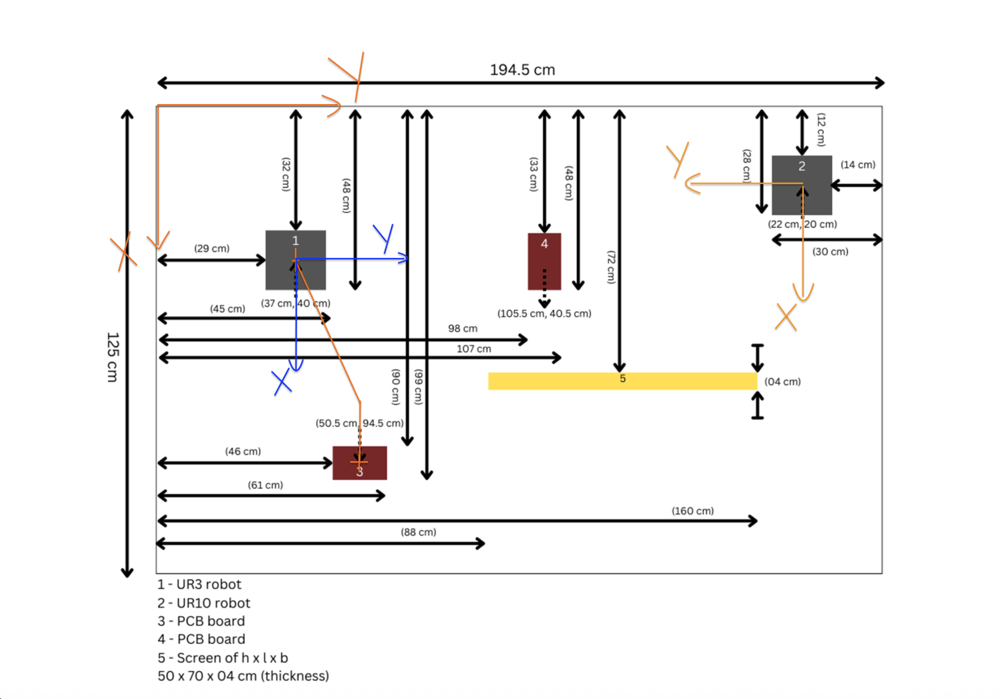
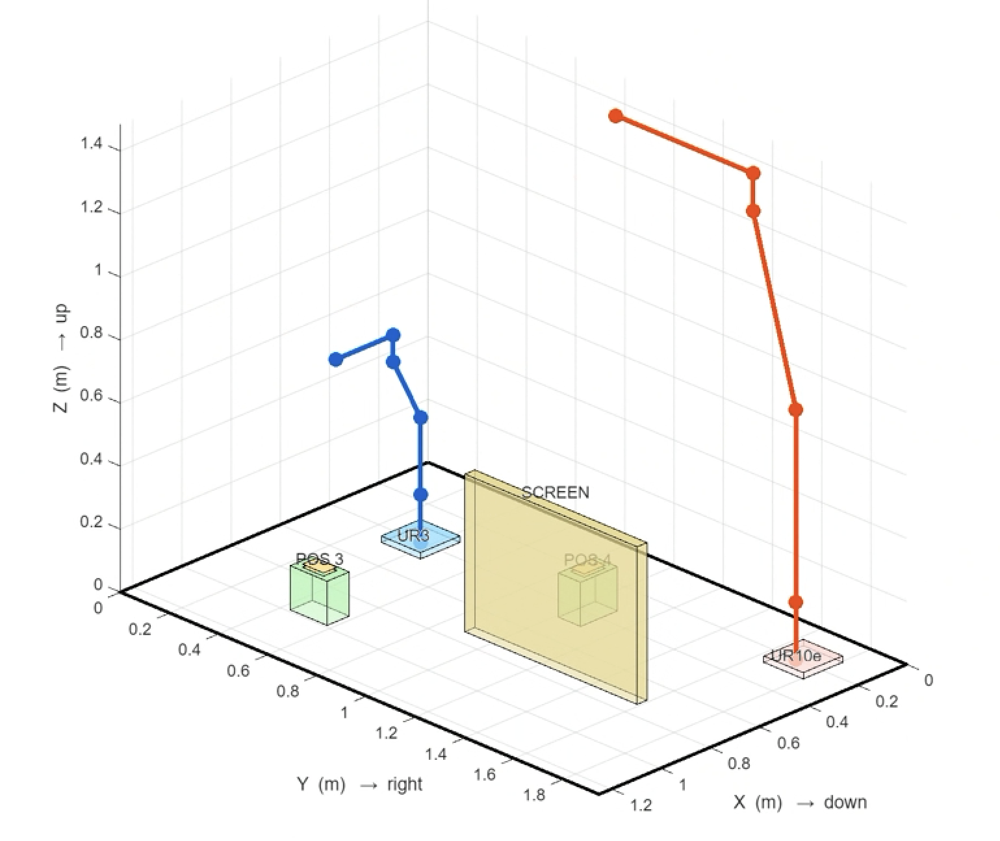

\# Robot Kinematics and Path Planning Simulation (MATLAB)

Simulation of robotic kinematics, trajectory planning, and feedback
control for a collaborative soldering cell with two manipulators (UR3
and UR10e).

Developed as part of the Robotics Control module (MSc Robotics
Engineering, Cranfield University).

\-\--

\## Project Overview

This project models a collaborative robotic cell where:

• UR3 robot picks a PCB board from holder position • UR3 places the PCB
at a soldering station • UR10e performs soldering operations on selected
PCB points

The simulation includes:

\- Forward kinematics - Inverse kinematics - Trajectory planning -
Feedback control - Singularity handling

\-\--

\## System Setup

Two robots operate on a shared workbench:

\- UR3: PCB pick-and-place - UR10e: soldering task

The workspace layout includes PCB holders, robots, and a protection
shield for the operator.

\-\--

\## Implemented Methods

Kinematics - Forward kinematics using homogeneous transformations -
Inverse kinematics for UR3 and UR10e

Control - Feedback control for trajectory tracking - Error injection to
simulate disturbances

Path Planning - Planned trajectory between PCB holder and soldering
points

\-\--

\## Workspace Layout

The collaborative soldering cell layout including the UR3 and UR10e
robots, PCB holders, and safety screen.

\

\-\--

\## MATLAB Simulation Environment

3D simulation of the robotic cell used for kinematics and trajectory
planning.

\

\## How to Run

1\. Open MATLAB 2. Navigate to the repository folder

Run the simulation:
